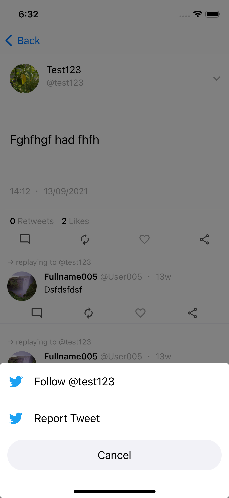

#  TwitterApp

Аналог твиттера на Firebase.
Архитектура MVVM

Features:
- Регистрация/авторизация через email
- Создание твита
- Создание ответа к твиту, вложенность не ограничена
- Просмотр юзеров, возможность подписки
- Отображение ленты со своими твитами и твитами тех на кого подписан
- Уведомления об ответов, новых подписчиков

## Screens

|||||
|:----------------------------:|:------------------------:|:------------------------:|:------------------------:|

|||||
|:----------------------------:|:----------------------------:|:------------------------:|:------------------------:|

||||
|:----------------------------:|:----------------------------:|:------------------------:|
